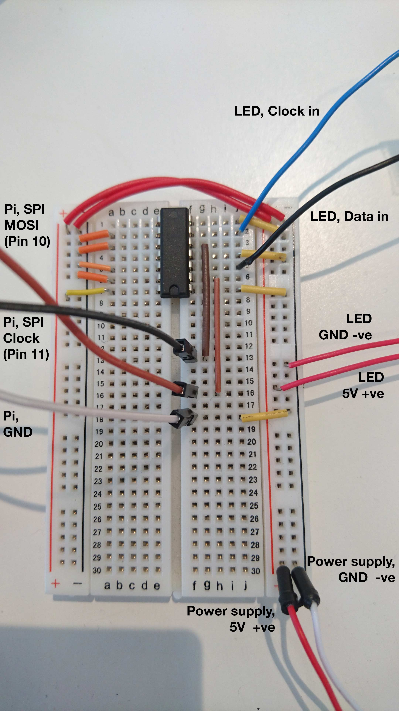
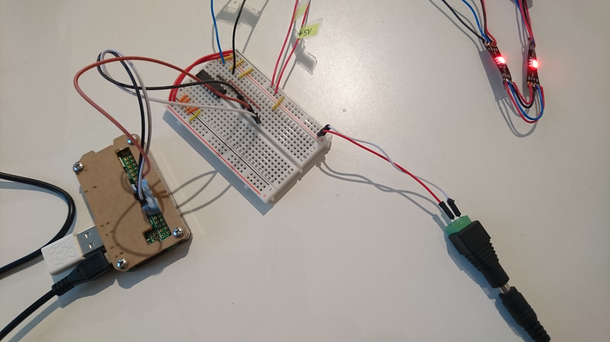

# Eye-lighter

Light up a strip of Dotstar APA102 LED lights with a Raspberry Pi, based on when people are in the studio.

We have sliced up our LED strip and re-soldered them together behind pictures, so that they become glowing eyes.

## Setup

This repo should be checked out onto the Raspberry Pi.

There are two main parts to the codebase:

 - **Scraper**: This accesses our router regularly and identifies who is in
 - **Eye Lighter**: This uses the data generated by the scraper to control the LEDs


## Scraper

Note that this is quite specific to our router, although the logic could be reapplied to any router.

### Installation

From the `/scraper` directory, follow these instructions:

Install virtualenv:

```
sudo pip install virtualenv
```

Create a virtualenv:

```
virtualenv env
source env/bin/activate
```

Install the requirements:

```
pip install -r requirements.txt
```

### Config

Duplicate the `config.example.py` file, call it `config.py`

Update the router login details, and the list of people


### Running the scraper

```
$ python scrape.py
```

This needs to be run as a background process when the Pi is powered up, so that it can keep the data updated.


## Eye-lighter

Once the scraper is running, it will keep the `eye-lighter/people.json` file up-to-date.

To start the eye-lighter, move into the `eye-lighter` directory and run:

```
$ python eye-lighter.py
```

This should be run as a background process when the Pi is powered up, as it updates the state of the LEDs.


## Pi setup

To start this on boot, edit the following file:

```
sudo nano /etc/rc.local
```

Add to the bottom of the file:

```
# eye lighter
. /home/pi/eye-lighter/scraper/env/bin/activate          # may not be necessary
python /home/pi/eye-lighter/scraper/scrape.py &
python /home/pi/eye-lighter/eye-lighter/eye-lighter.py &
```

If you need to debug output:

```
exec 2> /tmp/rc.local.log
exec 1>&2
set -x
```

There are a few places in the `scrape.py` file and `eye-lighter.py` file that you may need to change code to get it to run on Pi load - absolute paths to files, and sleeping before initialisation. Look at the relevant comments to see what might need to be changed.


## LEDs

This setup guide assumes that the _eye-lighter_ will be run on a Raspberry Pi.

Due to differences in voltage between the Pi (3.3V) and the Dotstar APA102 LED lights (5V), a [74AHCT125 chip](https://thepihut.com/products/adafruit-74ahct125-quad-level-shifter-3v-to-5v-74ahct125) is used between the two.





 - connect the pi to a breadboard - [pins 10, 11 and ground](https://www.raspberrypi.org/documentation/usage/gpio-plus-and-raspi2/)
 - connect the pi to the [74AHCT125 chip](https://learn.adafruit.com/dotstar-pi-painter/assembly-part-1#test-dotstar-strip)
 - connect the 5V power supply to the breadboard
 - connect the power supply to the 74AHCT125 chip
 - connect the leds to the breadboard
 - connect the leds to the 74AHCT125 chip

To test that the LEDs are wired up correctly, you can run the `led-tester/test.py` script (taken from [Adafruit](https://learn.adafruit.com/adafruit-dotstar-leds))
